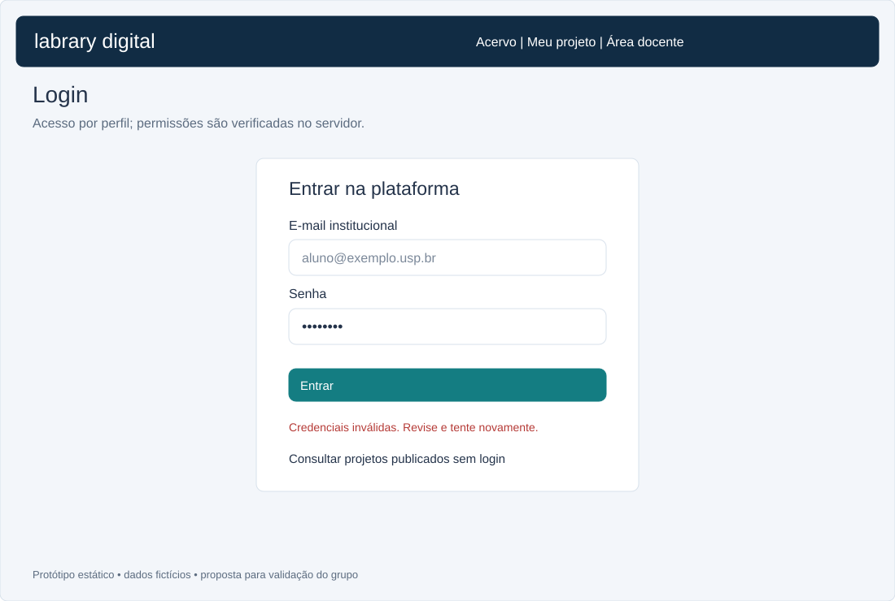
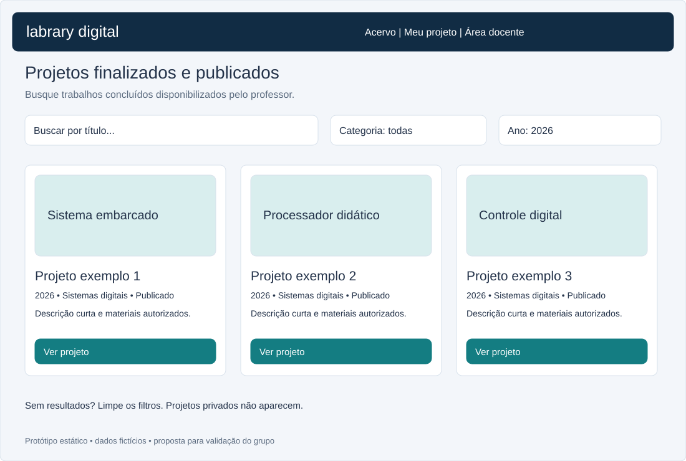
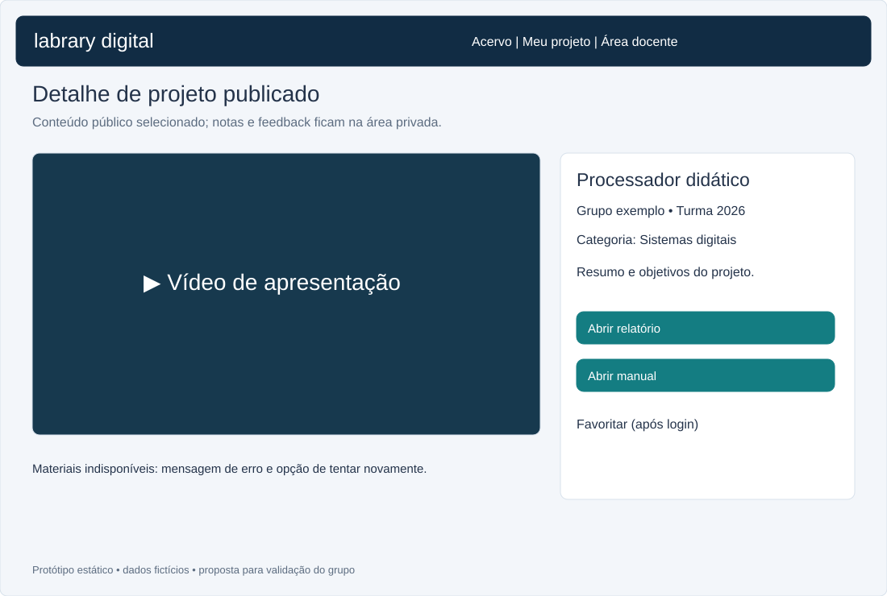
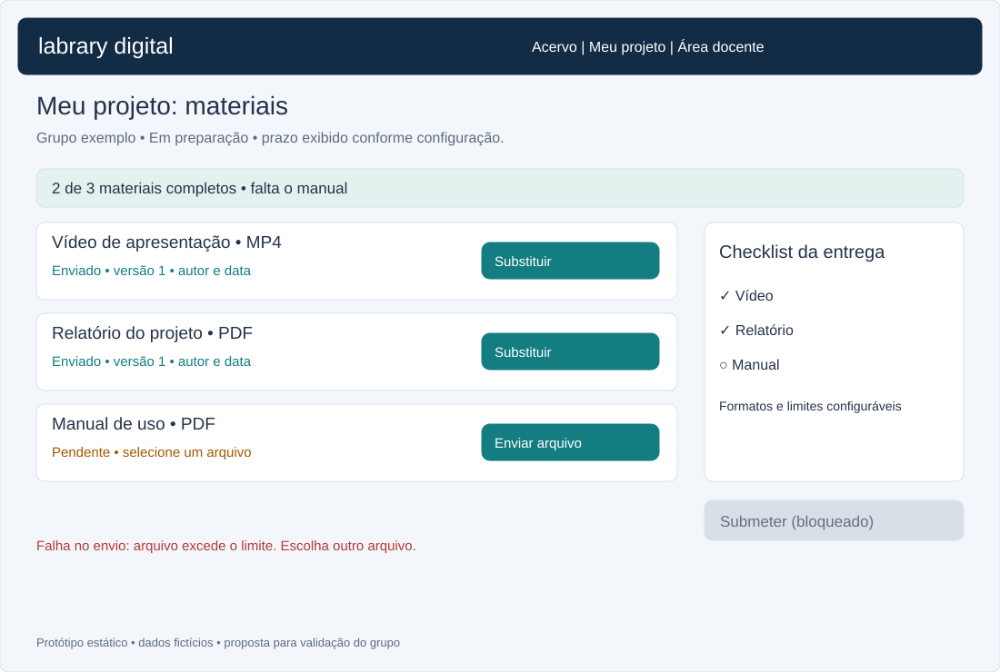
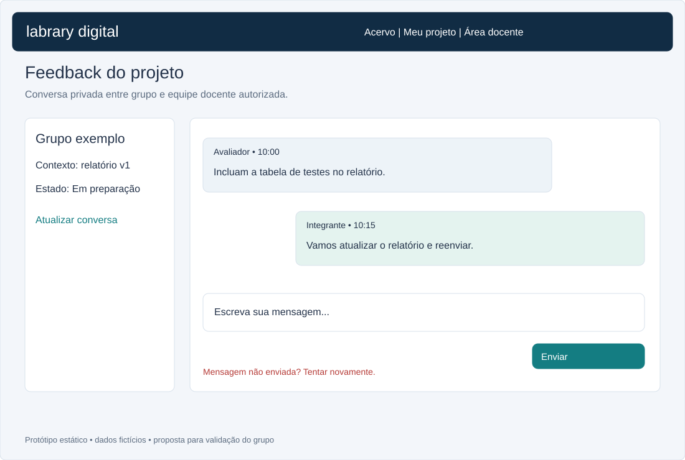
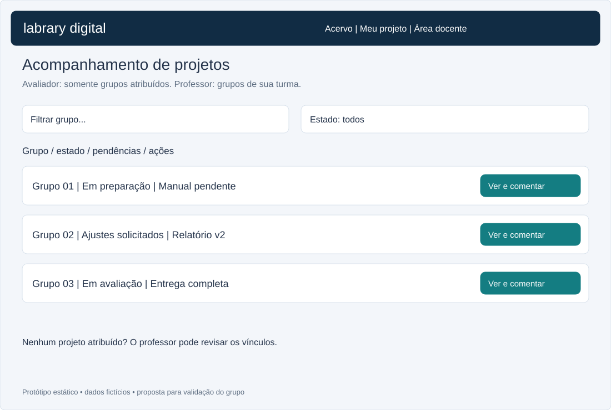
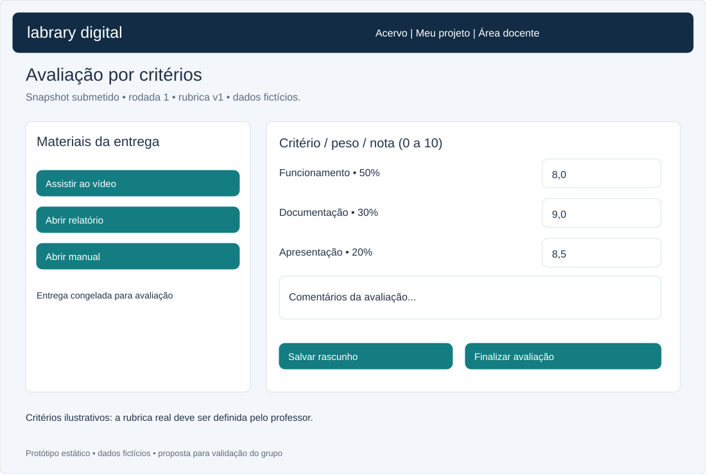
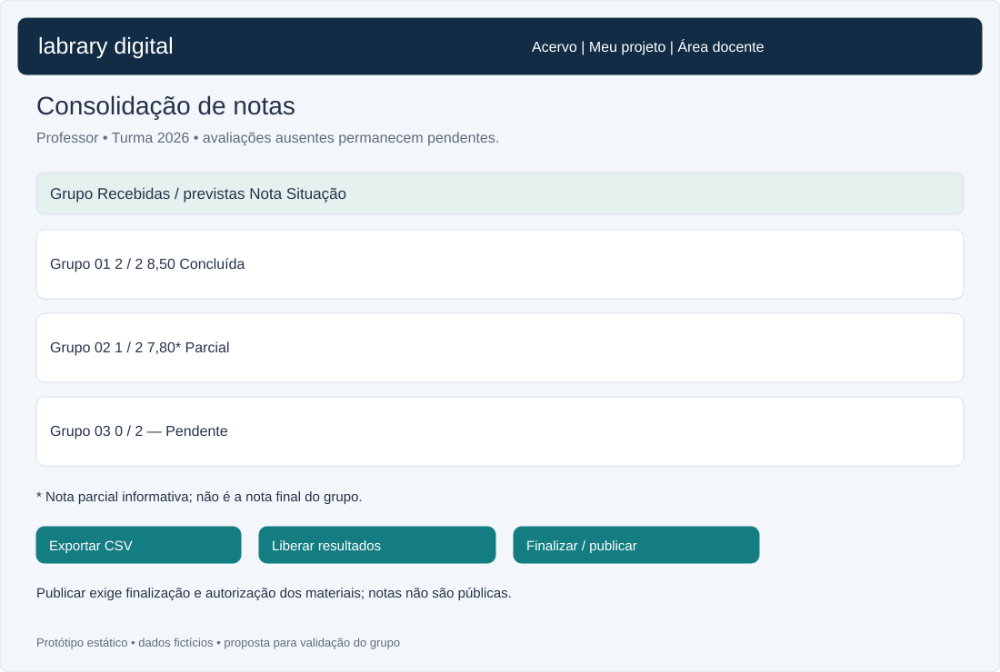
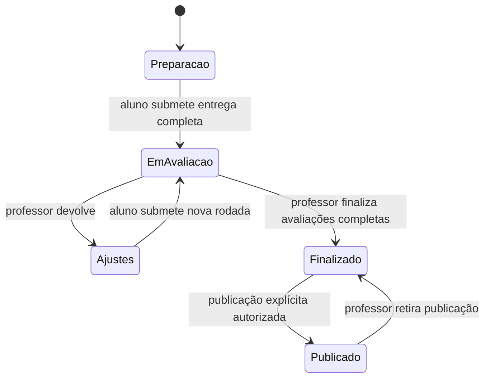
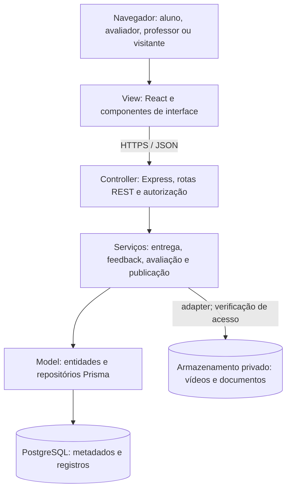

# Labrary Digital

> Documento de definição do projeto e planejamento Scrum — PCS3643, Laboratório de Engenharia de Software I.
> Plataforma voltada aos projetos de Laboratório de Projeto de Sistemas Digitais.
> Versão inicial: 04/10/2026. Situação: planejamento e protótipos; sistema ainda não implementado.

## 1. Tema

**Gestão, avaliação e divulgação de projetos acadêmicos de sistemas digitais.**

A plataforma centraliza os materiais de cada grupo — vídeo de apresentação, relatório do projeto e manual de uso —, permite feedback durante o desenvolvimento, avaliação por critérios e consolidação de notas. Depois da finalização, o professor pode publicar o projeto no acervo para todos os usuários, incluindo visitantes.

### Problema e objetivo

Arquivos, comentários e avaliações dispersos dificultam acompanhar pendências, garantir que todos avaliem a mesma versão e consolidar os resultados. O Labrary Digital reúne o ciclo de entrega e transforma projetos autorizados em um acervo consultável.

### Escopo inicial

- Login e autorização por perfil.
- Cadastro de grupos, projetos, requisitos e rubrica pela equipe docente.
- Envio e versionamento de materiais pelos alunos.
- Checklist de entrega e submissão para avaliação.
- Acompanhamento e conversa de feedback privados.
- Avaliação por critérios e consolidação de notas.
- Liberação de resultados para o próprio grupo.
- Finalização e publicação explícita de materiais autorizados.
- Galeria pública de projetos concluídos, com busca e filtros.

Histórico, favoritos, estatísticas e sugestões são complementos propostos no backlog P2. Chat em tempo real, pagamentos e integração com autenticação USP não fazem parte do MVP; qualquer ampliação depende de refinamento.

### Alinhamento com o enunciado geral

O tema é uma **adaptação proposta de plataforma de conteúdo digital**. O enunciado aceita propor outro tipo de conteúdo, sujeito à avaliação do professor. Não há registro de aprovação nesta entrega.

| Requisito do enunciado | Tratamento no Labrary Digital |
| --- | --- |
| Conteúdo digital, categorias, metadados e acesso mobile | Vídeo, relatório e manual; categoria, título, turma e ano; layout responsivo |
| Cadastro de usuários | Contas e vínculos provisionados pelo professor no MVP; cadastro público depende de validação |
| Avaliações e comentários | Rubrica docente e feedback privado; confirmar se substituem avaliação pública do catálogo |
| Busca e filtros | HU12 |
| Histórico, vistos, listas e recomendações | HU13–HU14, complementares; se o professor mantiver a exigência, promover a P0 |
| Administração e estatísticas | Professor gerencia projetos; estatísticas previstas na HU14 |
| Assinatura individual/familiar e quatro perfis | Não incorporadas ao MVP acadêmico; solicitar decisão explícita do professor |
| Restrição etária e idade mínima da assinatura individual | Não incorporadas; validar a adaptação com o professor |
| Receita, custos de conteúdo e infraestrutura | Não incorporados como funcionalidade; validar dispensa ou criar histórias adicionais |
| MVC, REST, testes, cobertura, CI e instalação | Mantidos no planejamento técnico |

**Pendência acadêmica:** validar tema, substituições e dispensas com o professor antes de considerar o escopo aprovado. Não interpretar esta tabela como atendimento integral aos requisitos originais.

## 2. Nome do sistema e do grupo

- **Sistema:** Labrary Digital.
- **Origem:** lab + library; biblioteca digital dos projetos de laboratório.
- **Nome proposto do grupo:** Equipe Labrary Digital, a confirmar.
- **Número do grupo:** a preencher.
- **Repositório:** [Labrary-Digital-PCS-3643](https://github.com/henriquemantovan/Labrary-Digital-PCS-3643).

| Integrante | Perfil GitHub |
| --- | --- |
| Henrique Mantovan | [henriquemantovan](https://github.com/henriquemantovan) |
| Enzo Pimentel | [enplo](https://github.com/enplo) |
| Dan Kiyochi | [kiyochii](https://github.com/kiyochii) |
| Yuhang | [yuhangf2333](https://github.com/yuhangf2333) |
| Kauê Barbosa | [kauebmr](https://github.com/kauebmr) |

Os quatro nomes civis não foram informados; os perfis exatos fornecidos pelo grupo identificam os integrantes sem inferir nomes.

A aula sugere o padrão de repositório `pcs3643-grupoX-nomedoprojeto`. Foi mantido o nome solicitado pelo grupo; confirmar com o professor se isso atende à entrega. A aula também pede compartilhar o link com `higoramario`; isso permanece uma ação do grupo, sem convite enviado nesta etapa.

## 3. Crazy 8

As imagens do Crazy8 feito em sala ficaram em docs/crazy8

## 4. Histórias de usuários

As funcionalidades foram registradas como issues no formato **Como [papel], eu gostaria de [ação], de forma que [benefício]**, com tarefas, critérios de aceitação, responsável proposto, dependências, estimativa e definição de Done.

| Perfil | Acesso |
| --- | --- |
| Visitante | Acervo e materiais publicados |
| Aluno | Materiais e feedback do próprio grupo; resultados liberados |
| Avaliador | Projetos atribuídos, feedback e avaliações |
| Professor | Grupos da turma, requisitos, rubrica, consolidação, liberação e publicação |

### [HU01 — Autenticar usuários e controlar permissões](https://github.com/henriquemantovan/Labrary-Digital-PCS-3643/issues/1)

**Como usuário, eu gostaria de entrar com minhas credenciais, de forma que possa acessar as funções permitidas ao meu perfil.**

- Prioridade P0; sprint sugerida 2; 5 pontos; responsável @henriquemantovan.
- Dependências: nenhuma.

**Critérios de aceitação:**

- [ ] Login válido abre a área do perfil; credenciais inválidas exibem erro sem revelar dados.
- [ ] Logout invalida a sessão.
- [ ] Aluno acessa apenas seu grupo; avaliador apenas projetos atribuídos; professor gerencia sua turma.
- [ ] A API rejeita acesso indevido mesmo quando a URL é acessada diretamente.

### [HU02 — Cadastrar grupos e projetos](https://github.com/henriquemantovan/Labrary-Digital-PCS-3643/issues/2)

**Como professor, eu gostaria de cadastrar grupos, integrantes e projetos da turma, de forma que possa organizar as entregas.**

- Prioridade P0; sprint sugerida 3; 5 pontos; responsável @yuhangf2333.
- Dependências: HU01.

**Critérios de aceitação:**

- [ ] Projeto tem título, descrição, turma, ano e categoria.
- [ ] Professor vincula integrantes e avaliadores à turma/projeto.
- [ ] Aluno vê somente projetos do próprio grupo na área de entrega.
- [ ] Alterações de vínculos preservam o histórico.

### [HU03 — Configurar requisitos e critérios de avaliação](https://github.com/henriquemantovan/Labrary-Digital-PCS-3643/issues/3)

**Como professor, eu gostaria de definir materiais obrigatórios, prazo e rubrica, de forma que possa padronizar a entrega e a avaliação.**

- Prioridade P0; sprint sugerida 3; 5 pontos; responsável @yuhangf2333.
- Dependências: HU01.

**Critérios de aceitação:**

- [ ] Vídeo, relatório e manual são requisitos obrigatórios iniciais.
- [ ] Cada requisito possui formatos, tamanho máximo e prazo definidos.
- [ ] Rubrica define critérios, escala de 0 a 10 e pesos positivos cuja soma é 100%.
- [ ] Mudanças após início de avaliações exigem nova versão explícita; avaliações preservam a rubrica utilizada.

### [HU04 — Enviar e substituir materiais](https://github.com/henriquemantovan/Labrary-Digital-PCS-3643/issues/4)

**Como aluno, eu gostaria de enviar vídeo, relatório e manual do projeto, de forma que possa cumprir os requisitos de entrega.**

- Prioridade P0; sprint sugerida 3; 8 pontos; responsável @enplo.
- Dependências: HU02,HU03.

**Critérios de aceitação:**

- [ ] Arquivos válidos são persistidos e vinculados ao projeto; nenhum acesso público é criado na etapa de rascunho.
- [ ] Formato e tamanho são validados no servidor; falhas exibem mensagem e permitem tentar novamente.
- [ ] Tela mostra progresso, data, autor e versão; substituição mantém histórico.
- [ ] Envio é permitido somente ao próprio grupo, enquanto a entrega está aberta.

### [HU05 — Concluir a entrega do projeto](https://github.com/henriquemantovan/Labrary-Digital-PCS-3643/issues/5)

**Como aluno, eu gostaria de verificar pendências e submeter o projeto, de forma que possa encaminhar uma entrega completa para avaliação.**

- Prioridade P0; sprint sugerida 4; 5 pontos; responsável @enplo.
- Dependências: HU04.

**Critérios de aceitação:**

- [ ] Checklist mostra os materiais obrigatórios presentes e ausentes.
- [ ] Submissão incompleta ou fora do prazo é bloqueada, salvo reabertura explícita pelo professor.
- [ ] Submissão registra data e snapshot dos materiais e muda estado para Em avaliação.
- [ ] Materiais submetidos ficam bloqueados; devolução para ajustes cria nova rodada e preserva a anterior.

### [HU06 — Acompanhar projetos em andamento](https://github.com/henriquemantovan/Labrary-Digital-PCS-3643/issues/6)

**Como avaliador, eu gostaria de visualizar projetos atribuídos ainda em preparação, de forma que possa orientar os grupos antes da entrega.**

- Prioridade P0; sprint sugerida 4; 3 pontos; responsável @kiyochii.
- Dependências: HU01,HU02,HU04.

**Critérios de aceitação:**

- [ ] Lista filtra por grupo, estado e pendências.
- [ ] Detalhe permite visualizar materiais autorizados e versões.
- [ ] Projetos não atribuídos ficam inacessíveis ao avaliador.
- [ ] Nenhuma nota ou comentário privado aparece na galeria pública.

### [HU07 — Trocar feedback no projeto](https://github.com/henriquemantovan/Labrary-Digital-PCS-3643/issues/7)

**Como aluno ou avaliador, eu gostaria de trocar mensagens no projeto, de forma que possa esclarecer dúvidas e orientar melhorias.**

- Prioridade P0; sprint sugerida 4; 5 pontos; responsável @kiyochii.
- Dependências: HU06.

**Critérios de aceitação:**

- [ ] Somente integrantes do grupo e equipe docente autorizada podem ler e enviar mensagens.
- [ ] Mensagens persistem com autor, data e contexto da versão do material.
- [ ] Atualizar ou reabrir a página conserva a conversa em ordem cronológica.
- [ ] Erros de envio são indicados sem duplicar mensagens; conteúdo é escapado para prevenir scripts.
- [ ] MVP usa comentários com atualização manual, sem exigir chat em tempo real.

### [HU08 — Avaliar projetos por rubrica](https://github.com/henriquemantovan/Labrary-Digital-PCS-3643/issues/8)

**Como avaliador, eu gostaria de registrar notas e comentários por critério, de forma que possa avaliar os projetos de maneira consistente.**

- Prioridade P0; sprint sugerida 5; 8 pontos; responsável @yuhangf2333.
- Dependências: HU03,HU05.

**Critérios de aceitação:**

- [ ] Avaliador autorizado vê o snapshot submetido e a rubrica correspondente.
- [ ] Notas fora da escala são rejeitadas; rascunho e avaliação final são diferenciados.
- [ ] Finalização exige todos os critérios; registra autor, data e rodada.
- [ ] Professor pode reabrir avaliação com justificativa; o histórico permanece auditável.

### [HU09 — Consolidar notas dos grupos](https://github.com/henriquemantovan/Labrary-Digital-PCS-3643/issues/9)

**Como professor, eu gostaria de consultar a consolidação das avaliações, de forma que possa acompanhar os resultados e identificar pendências.**

- Prioridade P0; sprint sugerida 5; 5 pontos; responsável @kauebmr.
- Dependências: HU08.

**Critérios de aceitação:**

- [ ] Tabela exibe grupo, avaliadores previstos, recebidos, nota e situação.
- [ ] Nota por avaliador = soma(nota do critério × peso/100); nota final = média das avaliações finalizadas previstas.
- [ ] Avaliações ausentes não contam como zero; resultado parcial é identificado e nota final só existe com todas concluídas.
- [ ] Cálculo preserva precisão interna e arredonda apenas exibição a duas casas; exportação CSV corresponde à tabela.
- [ ] Somente professor da turma acessa a consolidação completa.

### [HU10 — Consultar resultado do próprio grupo](https://github.com/henriquemantovan/Labrary-Digital-PCS-3643/issues/10)

**Como aluno, eu gostaria de consultar notas liberadas e comentários da avaliação, de forma que possa entender o resultado do projeto.**

- Prioridade P1; sprint sugerida 5; 3 pontos; responsável @kiyochii.
- Dependências: HU09.

**Critérios de aceitação:**

- [ ] Professor libera explicitamente os resultados da rodada.
- [ ] Integrantes veem apenas o resultado de seu grupo.
- [ ] Rubrica, notas por critério e comentários liberados são exibidos.
- [ ] Resultados ainda não liberados mostram estado pendente.

### [HU11 — Finalizar e publicar projetos](https://github.com/henriquemantovan/Labrary-Digital-PCS-3643/issues/11)

**Como professor, eu gostaria de finalizar e publicar um projeto aprovado para divulgação, de forma que possa disponibilizar seu conteúdo no acervo.**

- Prioridade P0; sprint sugerida 6; 5 pontos; responsável @henriquemantovan.
- Dependências: HU09.

**Critérios de aceitação:**

- [ ] Finalização exige materiais completos e avaliações concluídas; registra responsável e data.
- [ ] Publicação é ação explícita posterior à finalização; projeto finalizado não é automaticamente público.
- [ ] Professor seleciona os materiais autorizados para divulgação e registra autorização do grupo.
- [ ] Somente metadados e materiais autorizados tornam-se públicos; notas e feedback continuam privados.
- [ ] Professor pode retirar publicação preservando conteúdo e histórico privados.

### [HU12 — Explorar projetos publicados](https://github.com/henriquemantovan/Labrary-Digital-PCS-3643/issues/12)

**Como visitante ou usuário, eu gostaria de buscar e visualizar projetos publicados, de forma que possa conhecer os trabalhos concluídos.**

- Prioridade P0; sprint sugerida 6; 5 pontos; responsável @kiyochii.
- Dependências: HU11.

**Critérios de aceitação:**

- [ ] Galeria mostra apenas projetos Publicados.
- [ ] Busca por título e filtros por ano, turma e categoria podem ser combinados.
- [ ] Detalhe permite assistir ao vídeo e acessar relatório/manual autorizados.
- [ ] Projeto despublicado deixa de aparecer e seu acesso público direto é bloqueado.
- [ ] Galeria e detalhes funcionam em computadores e smartphones.

### [HU13 — Consultar histórico de acessos e favoritos](https://github.com/henriquemantovan/Labrary-Digital-PCS-3643/issues/13)

**Como usuário autenticado, eu gostaria de salvar favoritos e acompanhar projetos vistos, de forma que possa retomar conteúdos de interesse.**

- Prioridade P2; sprint sugerida 6; 3 pontos; responsável @henriquemantovan.
- Dependências: HU12.

**Critérios de aceitação:**

- [ ] Abrir conteúdo publicado registra acesso e marca como visto no perfil.
- [ ] Usuário pode incluir/remover favoritos e consultar sua lista.
- [ ] Histórico e favoritos são privados e isolados por usuário.
- [ ] Despublicação oculta o conteúdo do catálogo; registro histórico permanece para controle administrativo.

### [HU14 — Ver estatísticas e sugestões de conteúdo](https://github.com/henriquemantovan/Labrary-Digital-PCS-3643/issues/14)

**Como professor ou usuário autenticado, eu gostaria de consultar estatísticas ou receber sugestões conforme meu perfil, de forma que possa acompanhar o acervo e descobrir conteúdos relevantes.**

- Prioridade P2; sprint sugerida 6; 5 pontos; responsável @kauebmr.
- Dependências: HU13.

**Critérios de aceitação:**

- [ ] Professor vê acessos por projeto/categoria e quantidade de usuários de sua turma.
- [ ] Usuário recebe sugestões por categorias do histórico; sem histórico, vê projetos publicados recentes.
- [ ] Recomendações excluem conteúdos privados ou despublicados.
- [ ] Estatísticas não expõem histórico individual para outros alunos.

### Definição de concluído compartilhada

- [ ] Todos os critérios de aceitação atendidos.
- [ ] Código ou artefato revisado por outro integrante e aprovado.
- [ ] Testes unitários, integração e/ou sistema pertinentes passam.
- [ ] Cobertura de pelo menos 85% no escopo testável definido e documentado.
- [ ] Permissões, erros e acesso mobile verificados quando aplicáveis.
- [ ] Documentação e backlog atualizados.
- [ ] Incremento demonstrado na revisão da sprint.

## 5. Definição das responsabilidades

**Divisão proposta**, baseada nas áreas do projeto; habilidades e disponibilidade ainda precisam ser validadas pelos cinco integrantes. Todos participam do desenvolvimento, planejamento, revisão e testes. Papéis de Scrum não excluem a contribuição técnica.

| Integrante | Responsabilidade principal | Papel Scrum proposto | Itens sob responsabilidade |
| --- | --- | --- | --- |
| @henriquemantovan | Integração, arquitetura, acesso e publicação | Product Owner interno: ordenar backlog e levar dúvidas ao professor | HU01, HU11, HU13, TEC02, TEC06 |
| @enplo | Entrega de materiais e validação dos esboços | Developer | HU04, HU05, TEC03 |
| @kiyochii | Interface do acervo, feedback e resultados | Developer | HU06, HU07, HU10, HU12 |
| @yuhangf2333 | Regras de negócio, rubrica, API e CI | Developer | HU02, HU03, HU08, TEC04 |
| @kauebmr | Banco, consolidação e garantia da qualidade | Scrum Master interno e Developer | HU09, HU14, TEC01, TEC05 |

O professor é stakeholder e valida os requisitos acadêmicos; o papel interno de Product Owner não substitui essa validação. Scrum Master facilita eventos e remoção de impedimentos; não distribui unilateralmente tarefas.

**Revisão cruzada proposta:** Henrique ↔ yuhangf2333 nas APIs; enplo ↔ kiyochii nas interfaces; kauebmr revisa cálculo, persistência e testes, com revisão de outro integrante em seus próprios PRs. Compartilhar testes evita concentrar toda a qualidade em uma pessoa.

As responsabilidades estão no corpo das issues. Os convites para @enplo, @kiyochii, @yuhangf2333 e @kauebmr foram enviados e aguardam aceite. Após o aceite, os responsáveis poderão ser definidos no campo Assignees.

## 6. Montagem do backlog

**Acompanhamento central:** [Product Backlog e sprints — issue #21](https://github.com/henriquemantovan/Labrary-Digital-PCS-3643/issues/21).

O **Product Backlog** contém todas as histórias e tarefas técnicas. O **Sprint Backlog** contém o recorte que a equipe assume após avaliar capacidade. A coluna de sprint abaixo é uma sugestão de sequenciamento, não um compromisso já assumido.

Prioridades: **P0** essencial ao MVP/entrega técnica; **P1** importante; **P2** complemento condicionado à capacidade e à decisão do professor. Pontos são estimativas relativas iniciais, sem equivalência fixa em horas.

| Item | Entrega | Prioridade | Pontos | Sprint | Responsável proposto | Dependências |
| --- | --- | --- | ---: | ---: | --- | --- |
| [TEC01](https://github.com/henriquemantovan/Labrary-Digital-PCS-3643/issues/15) | Modelar e criar o banco de dados | P0 | 5 | 1 | @kauebmr | — |
| [HU01](https://github.com/henriquemantovan/Labrary-Digital-PCS-3643/issues/1) | Autenticar usuários e controlar permissões | P0 | 5 | 2 | @henriquemantovan | — |
| [TEC02](https://github.com/henriquemantovan/Labrary-Digital-PCS-3643/issues/16) | Preparar ambiente MVC/REST e APIs iniciais | P0 | 5 | 2 | @henriquemantovan | TEC01 |
| [TEC03](https://github.com/henriquemantovan/Labrary-Digital-PCS-3643/issues/17) | Validar Crazy 8 e protótipos com o grupo | P0 | 3 | 2 | @enplo | — |
| [TEC04](https://github.com/henriquemantovan/Labrary-Digital-PCS-3643/issues/18) | Implementar testes e integração contínua | P0 | 5 | 2 | @yuhangf2333 | TEC02 |
| [HU02](https://github.com/henriquemantovan/Labrary-Digital-PCS-3643/issues/2) | Cadastrar grupos e projetos | P0 | 5 | 3 | @yuhangf2333 | HU01 |
| [HU03](https://github.com/henriquemantovan/Labrary-Digital-PCS-3643/issues/3) | Configurar requisitos e critérios de avaliação | P0 | 5 | 3 | @yuhangf2333 | HU01 |
| [HU04](https://github.com/henriquemantovan/Labrary-Digital-PCS-3643/issues/4) | Enviar e substituir materiais | P0 | 8 | 3 | @enplo | HU02,HU03 |
| [HU05](https://github.com/henriquemantovan/Labrary-Digital-PCS-3643/issues/5) | Concluir a entrega do projeto | P0 | 5 | 4 | @enplo | HU04 |
| [HU06](https://github.com/henriquemantovan/Labrary-Digital-PCS-3643/issues/6) | Acompanhar projetos em andamento | P0 | 3 | 4 | @kiyochii | HU01,HU02,HU04 |
| [HU07](https://github.com/henriquemantovan/Labrary-Digital-PCS-3643/issues/7) | Trocar feedback no projeto | P0 | 5 | 4 | @kiyochii | HU06 |
| [HU08](https://github.com/henriquemantovan/Labrary-Digital-PCS-3643/issues/8) | Avaliar projetos por rubrica | P0 | 8 | 5 | @yuhangf2333 | HU03,HU05 |
| [HU09](https://github.com/henriquemantovan/Labrary-Digital-PCS-3643/issues/9) | Consolidar notas dos grupos | P0 | 5 | 5 | @kauebmr | HU08 |
| [HU10](https://github.com/henriquemantovan/Labrary-Digital-PCS-3643/issues/10) | Consultar resultado do próprio grupo | P1 | 3 | 5 | @kiyochii | HU09 |
| [HU11](https://github.com/henriquemantovan/Labrary-Digital-PCS-3643/issues/11) | Finalizar e publicar projetos | P0 | 5 | 6 | @henriquemantovan | HU09 |
| [HU12](https://github.com/henriquemantovan/Labrary-Digital-PCS-3643/issues/12) | Explorar projetos publicados | P0 | 5 | 6 | @kiyochii | HU11 |
| [HU13](https://github.com/henriquemantovan/Labrary-Digital-PCS-3643/issues/13) | Consultar histórico de acessos e favoritos | P2 | 3 | 6 | @henriquemantovan | HU12 |
| [HU14](https://github.com/henriquemantovan/Labrary-Digital-PCS-3643/issues/14) | Ver estatísticas e sugestões de conteúdo | P2 | 5 | 6 | @kauebmr | HU13 |
| [TEC05](https://github.com/henriquemantovan/Labrary-Digital-PCS-3643/issues/19) | Validar fluxos pelo navegador e preparar instalação | P0 | 5 | 7 | @kauebmr | HU01,HU04,HU07,HU08,HU09,HU12,TEC04 |
| [TEC06](https://github.com/henriquemantovan/Labrary-Digital-PCS-3643/issues/20) | Atualizar documentação e preparar apresentação final | P0 | 3 | 7 | @henriquemantovan | TEC05 |

### Sprints semanais propostas

A aula prevê sete sprints entre 08/10 e 26/11, com apresentação final em 26/11/2026. As janelas abaixo são uma proposta operacional; confirmar as datas de revisão com o professor.

| Sprint | Janela proposta de 2026 | Objetivo | Itens sugeridos |
| --- | --- | --- | --- |
| 1 | 08–14/10 | DER, banco, migrações, script SQL e seed | TEC01 |
| 2 | 15–21/10 | Frontend inicial, APIs, classes, acesso e CI | TEC02, TEC03, HU01, TEC04 |
| 3 | 22–28/10 | Grupos, requisitos e envio versionado | HU02, HU03, HU04 |
| 4 | 29/10–04/11 | Submissão, acompanhamento e feedback; demonstração parcial | HU05, HU06, HU07 |
| 5 | 05–11/11 | Avaliação, consolidação e resultado do grupo | HU08, HU09, HU10 |
| 6 | 12–18/11 | Publicação e acervo; complementos conforme capacidade | HU11, HU12; HU13–HU14 se aprovadas |
| 7 | 19–25/11 | Aceitação, testes web, instalação limpa e apresentação | TEC05, TEC06 e correções |
| Entrega | 26/11 | Apresentação e conteúdo final | Demonstração e repositório atualizado |

Banco, testes, documentação e backlog evoluem em todas as sprints; não são encerrados após sua sprint inicial.

### Fluxo de trabalho e eventos

- **Planejamento semanal:** definir objetivo, selecionar itens prontos e assumir responsáveis.
- **Alinhamento breve:** comunicar progresso, próxima ação e impedimentos.
- **Revisão semanal:** demonstrar incremento e registrar aceite/ajustes.
- **Retrospectiva:** definir uma melhoria concreta do processo.
- **Refinamento:** revisar critérios, dependências e estimativas antes da próxima sprint.
- **Kanban proposto:** Backlog → Pronto → Em andamento → Em revisão → Concluído. Impedimentos são sinalizados e documentados.
- **Pronto:** critérios claros, responsável, estimativa, dependências tratadas e protótipo validado quando aplicável.
- **Concluído:** Definition of Done satisfeita; fechar a issue após aceite, preferencialmente vinculando o PR.

O backlog foi montado nas issues, conforme solicitado. A issue de acompanhamento agrega checklists por sprint e uma visão inicial dos estados. Um quadro GitHub Projects não foi criado; a equipe pode espelhar esse fluxo nele quando disponível.

## 7. Protótipo da interface (telas do sistema)

Os SVGs abaixo são **wireframes estáticos de desktop**, com dados fictícios. Não representam telas implementadas. A validação de navegação mobile integra a TEC03 e o desenvolvimento das histórias.

### Tela 1 — Login

### Tela 2 — Projetos finalizados e publicados

### Tela 3 — Detalhe de projeto publicado

### Tela 4 — Meu projeto: materiais

### Tela 5 — Feedback do projeto

### Tela 6 — Acompanhamento de projetos

### Tela 7 — Avaliação por critérios

### Tela 8 — Consolidação de notas

### Navegação e comportamento previstos

| Tela | Perfil | Ações e histórias relacionadas |
| --- | --- | --- |
| Login | Usuário | Entrar, sair, erro de autenticação — HU01 |
| Acervo | Todos | Buscar e filtrar; abrir publicado — HU12 |
| Detalhe público | Todos | Vídeo, relatório e manual autorizados — HU11–HU12 |
| Materiais | Aluno | Enviar/substituir, checklist e submeter — HU04–HU05 |
| Feedback | Grupo e docentes autorizados | Ler, enviar e atualizar mensagens — HU07 |
| Acompanhamento | Avaliador/professor | Filtrar pendências, abrir materiais e feedback — HU06 |
| Avaliação | Avaliador | Rubrica, rascunho e finalização — HU08 |
| Consolidação | Professor | Pendências, nota, CSV, liberação e publicação — HU09–HU11 |

O aluno acessa o resultado liberado em uma aba do próprio projeto (HU10); cadastro de grupos e configuração de rubrica ficam na área docente (HU02–HU03). Esses fluxos auxiliares serão refinados na TEC03.

### Regras de interface

- Mostrar estado do projeto, progresso de envio, pendências, sucesso e falha.
- Manter navegação, nomes e ações consistentes; confirmar submissão e publicação.
- Desabilitar submissão incompleta e explicar o motivo.
- Exibir nota parcial como parcial e manter ausência de avaliação como pendência.
- Permitir navegação por teclado, rótulos de campo, foco visível e informações além da cor.
- Em smartphones, empilhar cartões e campos; tabela de notas deve ter rolagem identificada ou cartões por grupo.
- Mostrar estados de carregamento, lista vazia, perda de sessão e falha de envio com recuperação.

### Ciclo do projeto

Preparação e Ajustes permitem edição conforme prazo/reabertura. Em avaliação usa snapshot imutável. Finalizado é privado até a ação explícita de publicação. Feedback e notas nunca entram na exposição pública automaticamente.

## 8. Tecnologias do sistema

**Stack proposta, ainda não instalada ou validada.** A escolha prioriza uma aplicação pequena, com TypeScript no frontend/backend e separação MVC/REST. A baseline exata deve ser registrada na TEC02, usando versões compatíveis fixadas no lockfile e nas imagens; não declarar versões ou instalação como verificadas antes disso.

| Camada | Tecnologia proposta | Uso |
| --- | --- | --- |
| Frontend | React + TypeScript + Vite | Views, formulários e navegação por perfil |
| Estilo | CSS responsivo | Layout desktop/mobile e componentes visuais |
| Backend | Node.js + TypeScript + Express | Controllers REST, autorização e regras de negócio |
| Persistência | PostgreSQL + Prisma | Models, relações, migrações e acesso ao banco |
| Arquivos | Volume privado no MVP; adapter de armazenamento | Vídeos/PDFs separados dos metadados; acesso passa pela autorização |
| Sessões | Cookie HttpOnly e sessão no servidor | Autenticação; hash seguro de senha e proteção de operações de escrita |
| Testes | Vitest, Testing Library e Supertest | Unidade, interface e integração de APIs |
| Navegador | Playwright | Sistema, mobile e gravação de pelo menos cinco vídeos |
| Qualidade/CI | ESLint, TypeScript e GitHub Actions | Build, testes e cobertura mínima de 85% |
| Ambiente | Docker Compose e scripts de inicialização | Aplicação, banco, volume persistente e instalação reprodutível |
| Gestão | GitHub Issues e pull requests | Backlog, revisão e rastreabilidade |
| Diagramas | Mermaid | Componentes, DER e estados no repositório |

**Instalação futura:** README deverá informar versões exatas, pré-requisitos, `.env.example` sem segredos, comandos de instalação/build, subida conjunta de frontend e backend, SQL/migrações, seed/dump e execução dos testes no Ubuntu 26.04. Os comandos executáveis serão adicionados quando a implementação existir, e a TEC05 verificará instalação em ambiente novo.

**Badges de testes e cobertura:** pendentes de workflows reais; não foram inseridos badges fictícios.

## 9. Arquitetura: componentes da aplicação

### Visão dos componentes e separação MVC

A View apresenta dados e captura ações. Controllers validam requisições, autenticam e autorizam; serviços aplicam regras. Models/repositórios cuidam dos dados persistidos. Arquivos têm acesso mediado pelo backend, inclusive quando o projeto possui uma versão pública. O frontend não acessa diretamente o banco.

### Componentes funcionais

| Componente | Responsabilidade |
| --- | --- |
| Identidade e autorização | Sessão, perfis, vínculos com turma/grupo e projetos atribuídos |
| Projetos e requisitos | Metadados, requisitos, prazos e estados |
| Materiais e submissões | Upload, versionamento, validação e snapshot da entrega |
| Feedback | Mensagens privadas contextualizadas |
| Avaliações | Rubricas versionadas, rascunhos, finalização e histórico |
| Consolidação | Notas ponderadas, avaliações pendentes e CSV |
| Publicação e catálogo | Materiais autorizados, busca e despublicação |
| Descoberta e estatísticas | Histórico, favoritos, sugestões e contagens; itens P2 |

### Contratos REST propostos

| Método e rota | Finalidade |
| --- | --- |
| POST /api/sessions; DELETE /api/sessions/current | Login e logout |
| GET /api/me | Perfil e vínculos do usuário |
| POST /api/groups; POST /api/projects | Cadastro docente |
| GET /api/projects; GET /api/projects/:id | Listagem e detalhe conforme permissões |
| PUT /api/projects/:id/requirements | Configurar requisitos |
| POST /api/projects/:id/materials | Enviar nova versão, multipart |
| GET /api/materials/:id/content | Conteúdo com autorização; Range para vídeo |
| POST /api/projects/:id/submissions | Submeter snapshot completo |
| GET/POST /api/projects/:id/messages | Consultar e enviar feedback |
| PUT /api/submissions/:id/evaluations/me | Salvar avaliação do avaliador |
| POST /api/submissions/:id/evaluations/me/finalize | Finalizar avaliação |
| GET /api/classes/:id/grades | Consolidar notas para professor |
| POST /api/projects/:id/results/release | Liberar resultado ao grupo |
| POST /api/projects/:id/finalization | Finalizar projeto |
| POST/DELETE /api/projects/:id/publication | Publicar/retirar publicação |
| GET /api/catalog; GET /api/catalog/:id | Consulta pública somente de publicados |

## Rastreabilidade e pendências da entrega

| Exigência da aula | Local ou próximo passo |
| --- | --- |
| Tema | Seção 1; aprovação da adaptação pendente |
| Nome do sistema/grupo | Seção 2; nome do grupo proposto e número a confirmar |
| Crazy 8 e três escolhas | Seção 3 e SVG; sessão e imagens reais pendentes |
| Histórias de usuário | Seção 4 e issues HU01–HU14 |
| Responsabilidades | Seção 5 e texto de cada issue |
| Backlog do produto/sprints | Seção 6 e issue de acompanhamento |
| Imagens dos protótipos | Seção 7 e docs/prototipos |
| Tecnologias | Seção 8; versões a fixar na implementação |
| Arquitetura | Seção 9; MVC/REST e DER inicial |
| Compartilhamento com professor | Compartilhar link com higoramario conforme aula |
